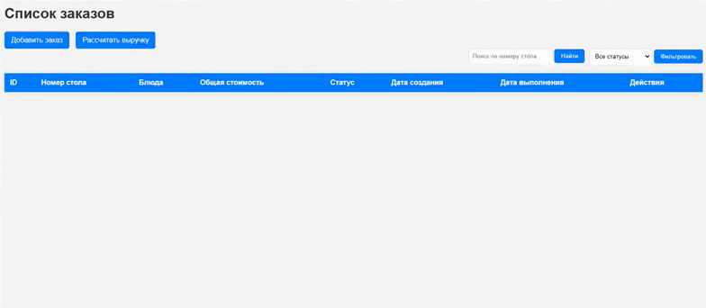

# Cafe Order Check

Tech Cafe — это веб-приложение для управления заказами в кафе и подсчета выручки за рабочий день. Проект разработан с использованием Django и Django REST Framework.

## Основные функции

- Создание, редактирование и удаление заказов.
- Управление блюдами и элементами заказов.
- Фильтрация заказов по статусу и номеру стола.
- Расчет выручки за день.

## Используемые технологии
- **Python 3.13**
- **Django**: Веб-фреймворк для создания приложения.
- **Django REST Framework**: Для создания API.
- **SQLite**: База данных по умолчанию.
- **Pytest**: Для написания тестов.


## Установка и запуск

### 1. Клонируйте репозиторий:
   ```
   https://github.com/Amore52/tech_cafe.git
   ```
### 2. Создайте файл переменных окружения ```.env```
   * ```DEBUG``` - настройка Django, которая определяет режим работы приложения.  
   * ```SECRET_KEY``` - Ваш секретный ключ
   

### 3. Создайте и активируйте виртуальное окружение:
   ```
    python -m venv .venv
    source .venv/bin/activate  # Для Linux/MacOS
    .venv\Scripts\activate     # Для Windows
   ```

### 4. Установите зависимости:
   ```
   pip install -r requirements.txt
   ```
### 5. Создайте миграции для базы данных:
   ```
   python manage.py makemigrations
   ```
### 6. Примените миграции:
   ```
   python manage.py migrate
   ```

### 7. Создайте профиль администратора:
   ```
   python manage.py createsuperuser
   ```
### 8. Запустите сервер:
   ```
   python manage.py runserver
   ```

### 9. Откройте браузер и перейдите по адресу ```http://127.0.0.1:8000/```

## Пример создания и редактирования заказа

